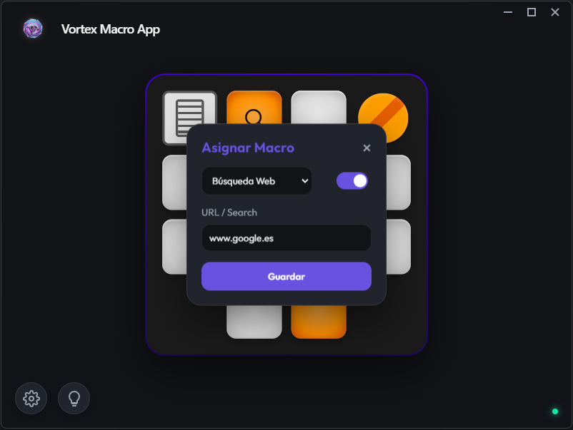
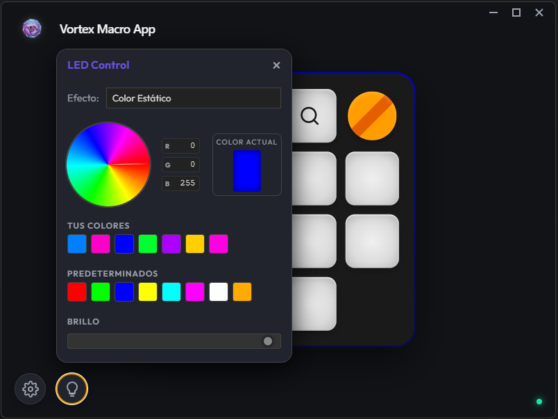

# Vortex Macro V2


**Vortex Macro V2** es una potente aplicación de gestión de macros diseñada para maximizar tu productividad y experiencia de juego. Con una interfaz moderna, oscura y totalmente personalizable, Vortex te permite asignar acciones complejas a cada tecla de tu dispositivo Vortex.

## ✨ Características Principales

### 🚀 Macros Inteligentes
Vortex ofrece 4 tipos de macros potentes para cubrir todas tus necesidades:

*   **🌐 Web / Búsqueda**: Abre cualquier página web al instante o realiza búsquedas rápidas en Google.
*   **📂 Abrir Programa (Launcher)**:
    *   **Inteligente y Multiplataforma**: La interfaz se adapta a tu sistema operativo.
        *   **Windows**: Detecta automáticamente tus programas instalados y ofrece un selector desplegable rápido, además de selección manual.
        *   **macOS / Linux**: Interfaz simplificada y directa para selección de rutas personalizadas.
    *   **Soporte Universal**: Compatible con ejecutables portables o scripts específicos.
*   **🔴 Grabadora (Recorder)**:
    *   **Alta Fidelidad**: Graba **exactamente** lo que haces, incluyendo cuánto tiempo mantienes pulsada una tecla.
    *   **Combinaciones**: Soporte total para `Ctrl+C`, `Alt+Tab` y atajos complejos con teclas modificadoras.
    *   **Timing Preciso**: Reproduce tus macros con la misma velocidad y ritmo con la que las grabaste.
*   **🖱️ Auto-Clicker**: Automatiza clics del ratón con intervalos personalizados.



### 🎨 Diseño Premium con UX Refinada
*   **Paneles Exclusivos**: Sistema de navegación inteligente que evita el desorden visual. Abrir un panel (Ajustes, LED, Volumen) cierra automáticamente los demás para que te concentres en lo importante.
*   **Interfaz Nativa en macOS**: Ventana sin bordes perfectamente integrada, ocultando los controles "traffic light" nativos para una estética 100% personalizada.
*   **Tema Adaptable**: Interfaz que respeta tu preferencia de tema (Claro/Oscuro), con un diseño Glassmorphism moderno.
*   **Visualización en Tiempo Real**: Las teclas se iluminan en la pantalla cuando pulsas tu dispositivo físico.
*   **Indicadores de Estado**: Feedback visual inmediato sobre la conexión de tu dispositivo.

### 💡 Control RGB Avanzado
Vortex V2 libera todo el potencial de tu hardware con un control de iluminación LED de última generación:

*   **Modos de Iluminación**:
    *   **Estático**: Elige cualquier color sólido de la rueda de colores.
    *   **Respiración (Breathing)**: Efecto suave de pulsación con cualquier color.
    *   **Circular Rotate / Vortex**: Efecto dinámico que rota entre **dos colores** seleccionados por ti. ¡Define tu propio gradiente!
    *   **Split Mode**: Divide el teclado en dos zonas de color (ej. Lila/Azul).
*   **Gestión de Energía**: Ajusta el brillo global o apaga los LEDs completamente.
*   **Sincronización Visual**: El teclado virtual en la app replica exactamente el efecto de tu teclado físico.


> *Panel de control RGB con selección de modo y colores.*

### 🔊 panel de Control de Volumen
Gestiona el comportamiento del Encoder rotatorio dedicado:
*   **Activar/Desactivar**: Decide si la ruedita controla el volumen del sistema.
*   **Gestión de Mute**: Configura el comportamiento del pulsador central.

### 🌍 Internacionalización (i18n)
*   **Soporte Multilenguaje**: Cambia al instante entre **Inglés (🇬🇧)** y **Español (🇪🇸)**.
*   **Persistencia**: La aplicación recuerda tu idioma preferido entre reinicios.

## 🛠️ Instalación y Uso

1.  **Requisitos Previos**:
    *   Node.js instalado.
    *   Dispositivo Vortex V2.

2.  **Instalación**:
    ```bash
    npm install
    # Si hay vulnerabilidades, el proyecto usa las ultimas versiones seguras.
    ```

3.  **Iniciar Aplicación**:
    ```bash
    npm start
    ```

4.  **Generar Ejecutable**:
    ```bash
    npm run make
    ```

## 🎮 Compatibilidad y Configuración Adicional

*   **Windows**: 
    *   Soporte nativo "Out of the Box" con detección de programas instalados.
    *   Usa inyección de teclas a bajo nivel (`keybd_event`) para máxima compatibilidad con juegos.

*   **macOS**: 
    *   Interfaz optimizada sin controles de ventana nativos.
    *   Integración fluida con AppleScript.
    *   ⚠️ **Importante**: Al ejecutar la app por primera vez, macOS solicitará permisos de **Accesibilidad**. Debes concederlos para que Vortex pueda simular pulsaciones de teclas y clics.

*   **Linux**: 
    *   Soporte mediante `xdotool`.
    *   ⚠️ **Requisito**: Debes instalar `xdotool` para que funcionen las macros de automatización y auto-clicker.
        ```bash
        # Debian/Ubuntu
        sudo apt-get install xdotool
        
        # Arch Linux
        sudo pacman -S xdotool
        
        # Fedora
        sudo dnf install xdotool
        ```

---
*Diseñado por Crow6093 para Power Users y Gamers.*
*Actualizado a Electron v39+ para máxima seguridad y rendimiento.*
