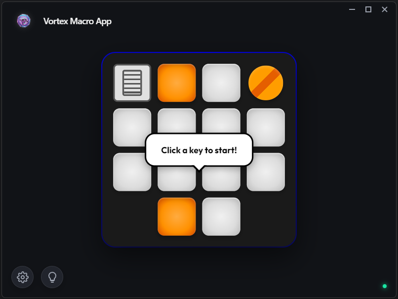

# Vortex Macro V2



**Vortex Macro V2** es una potente aplicación de gestión de macros diseñada para maximizar tu productividad y experiencia de juego. Con una interfaz moderna, oscuray totalmente personalizable, Vortex te permite asignar acciones complejas a cada tecla de tu dispositivo Vortex.

## ✨ Características Principales

### 🚀 Macros Inteligentes
Vortex ofrece 4 tipos de macros potentes para cubrir todas tus necesidades:

*   **🌐 Web / Búsqueda**: Abre cualquier página web al instante o realiza búsquedas rápidas en Google.
*   **📂 Abrir Programa (Launcher)**:
    *   **Detección Automática**: Escanea tu sistema (Windows, macOS, Linux) para listar tus aplicaciones instaladas.
    *   **Selector Inteligente**: Elige tu programa de una lista desplegable sin buscar rutas manualmente.
    *   **Soporte Custom**: ¿Programa portable? Usa el explorador de archivos para seleccionarlo.
*   **🔴 Grabadora (Recorder)**:
    *   **Alta Fidelidad**: Graba **exactamente** lo que haces, incluyendo cuánto tiempo mantienes pulsada una tecla.
    *   **Combinaciones**: Soporte total para `Ctrl+C`, `Alt+Tab` y atajos complejos con teclas modificadoras.
    *   **Timing Preciso**: Reproduce tus macros con la misma velocidad y ritmo con la que las grabaste.
*   **🖱️ Auto-Clicker**: Automatiza clics del ratón con intervalos personalizados.


### 🎨 Diseño Premium
*   **Tema Adaptable**: Interfaz que respeta tu preferencia de tema (Claro/Oscuro), con un diseño Glassmorphism moderno.
*   **Visualización en Tiempo Real**: Las teclas se iluminan en la pantalla cuando pulsas tu dispositivo físico.
*   **Indicadores de Estado**: Feedback visual inmediato sobre la conexión de tu dispositivo.

### 🔌 Detección de Hardware
La aplicación detecta automáticamente tu teclado **Vortex V2.0** (VID: `0xfeed`, PID: `0x6060`).
*   **Plug & Play**: Si desconectas el dispositivo, la app te avisa y pausa la interacción hasta que vuelvas a conectarlo.
*   **Persistencia**: Tus macros se guardan automáticamente y persisten entre reinicios.

## 🛠️ Instalación y Uso

1.  **Requisitos Previos**:
    *   Node.js instalado.
    *   Dispositivo Vortex V2.

2.  **Instalación**:
    ```bash
    npm install
    ```

3.  **Iniciar Aplicación**:
    ```bash
    npm start
    ```

4.  **Generar Ejecutable**:
    ```bash
    npm run make
    ```

## 🎮 Compatibilidad y Configuración Adicional

*   **Windows**: 
    *   Soporte nativo "Out of the Box".
    *   Usa inyección de teclas a bajo nivel (`keybd_event`) para máxima compatibilidad con juegos.

*   **macOS**: 
    *   Integración fluida con AppleScript.
    *   ⚠️ **Importante**: Al ejecutar la app por primera vez, macOS solicitará permisos de **Accesibilidad**. Debes concederlos para que Vortex pueda simular pulsaciones de teclas y clics.

*   **Linux**: 
    *   Soporte mediante `xdotool`.
    *   ⚠️ **Requisito**: Debes instalar `xdotool` para que funcionen las macros de automatización y auto-clicker.
        ```bash
        # Debian/Ubuntu
        sudo apt-get install xdotool
        
        # Arch Linux
        sudo pacman -S xdotool
        
        # Fedora
        sudo dnf install xdotool
        ```

---
*Diseñado para Power Users y Gamers.*
